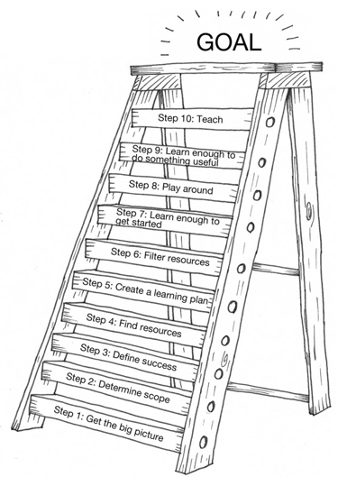

# Learning to Learn

This page tracks the effort to adopt learning suggestions from [Soft Skills: The software developer's life manual](https://www.safaribooksonline.com/library/view/soft-skills-the/9781617292392/) with its 10-steps solutions.

The first part of the 10-step process is the research portion and it’s done once. But steps 7 through10 are repeated for each module you end up creating in your learning plan. This technique ends up being effective because it forces you to clearly define a goal for what you’re trying to learn upfront, and it constantly moves you in the direction of that goal by actually doing instead of just reading or listening to lectures.

## Case Study 1: Container
### Step 1: Get the big picture
Remember, the goal isn’t to actually learn the topic here, but to just get a big picture of what it’s about and how big it is. If you happen to have a book on the subject, you might read an introductory chapter to skim through the material. 
- [Wikipedia](https://en.wikipedia.org/wiki/Docker_(software))
- [Basic Concepts](https://www.docker.com/what-container)
- [containerd](https://containerd.io/), which also introduces several open source components and how they are all related.
- [Docker open source](https://www.docker.com/open-source)
- [Docker explained](https://www.redhat.com/en/topics/containers/what-is-docker)
- [Linux Container](https://www.redhat.com/en/topics/containers/whats-a-linux-container)
- Basic Docker, Kubernetes usage info.
  - [Learn Docker - Fundamentals of Docker 18.x](https://www.safaribooksonline.com/library/view/learn-docker-/9781788997027/)
  - [Kubernetes Fundamentals](https://www.safaribooksonline.com/library/view/kubernetes-fundamentals/9781492032144/)
  - [Docker Deep Dive](https://app.pluralsight.com/library/courses/docker-deep-dive/table-of-contents)
  - [Docker Containers: From Start to Enterprise](https://www.safaribooksonline.com/library/view/docker-containers-from/9780134136639/)
  - [Docker Cookbook](https://www.safaribooksonline.com/library/view/docker-cookbook/9781491919705/)
  - [Learning Docker](https://www.safaribooksonline.com/library/view/learning-docker/9781491956885/)
  - [Docker Orchestration](https://www.safaribooksonline.com/library/view/docker-orchestration/9781787122123/)
  - [Working with Advanced Docker Operations](https://www.safaribooksonline.com/library/view/working-with-advanced/9781788471695/)

### Step 2: Determine scope
There are many sub-topics I can pursue. I believe Container networking (especially, datapath, its interaction with Linux bridge, OVS, DPDK, etc.) should be a very interesting topic for me. Before doing the container networking study, I should at least get familiar with usage of most popular container platform.

### Step 3: Define success
I should be able to determine,
- various kinds of container network architecture (from Docker, k8s, etc.)
- different implementations
- quickly deploy different network solutions, and benchmark their performance
- locate the exact code snippet that implements the feature, and do some hack

### Step 4: Find resources
Instead of reading a single book on a subject, try to gather many different resources to help you learn. This is similar to a brainstorming step. Later on you’ll filter your resources and select the best ones, but for now you want to get as many different resources as possible. The important thing is that you find a variety of different resources. You don’t want to be biased by the viewpoints of a single source and you want to have access to as much information as possible. Resource Ideas
- Google Search ("Docker network", "Kubernetes network") which can lead to the following resources.
- Books
- Blog posts
- Online videos
- Experts or people already knowledgeable about the topic you want to learn about
- Podcasts
- Source code
- Example projects
- Online documentation

I have found the following resources helpful.
- Keyword "Docker network"
  - [Configuring Network](https://docs.docker.com/network/)
  - https://www.terraform.io/docs/providers/docker/r/network.html
  - [`docker network` commands](https://docs.docker.com/engine/reference/commandline/network/)
  - [Understanding Docker Networking Drivers and their use cases](https://blog.docker.com/2016/12/understanding-docker-networking-drivers-use-cases/)
  - [Sreenivas Makam's presentations](https://www.slideshare.net/SreenivasMakam/presentations)
  - [Day in the Life: Docker Networking](https://www.youtube.com/watch?v=2vcLgcH_hDI)
  - [How Does Container Networking Work?](https://www.sdxcentral.com/cloud/containers/definitions/how-does-container-networking-work/)
  - https://github.com/docker/labs/tree/master/networking
  - [Docker Networking Tutorial](https://www.youtube.com/watch?v=EWG3d3XCBsg)
  - [Docker Network](https://github.com/docker/libnetwork)
- Keyword "Kubernetes network"
  - [Kubernetes Network](https://kubernetes.io/blog/2016/01/why-kubernetes-doesnt-use-libnetwork/)
  - [Cluster Networking](https://kubernetes.io/docs/concepts/cluster-administration/networking/)
  - [CNM vs. CNI](http://www.nuagenetworks.net/blog/container-networking-standards/)
  - [Operating a Kubernetes network](https://jvns.ca/blog/2017/10/10/operating-a-kubernetes-network/)
  - [A Hacker’s Guide to Kubernetes Networking](https://thenewstack.io/hackers-guide-kubernetes-networking/)
  - [An illustrated guide to Kubernetes Networking \[Part 1\]](https://medium.com/@ApsOps/an-illustrated-guide-to-kubernetes-networking-part-1-d1ede3322727)
- Keyword "Docker DPDK"-
  - [dpdk-container-lab](https://github.com/intel/SDN-NFV-Hands-on-Samples/tree/master/DPDK_in_Containers_Hands-on_Lab/dpdk-container-lab)
  - [DPDK in Linux* Containers Playlist](http://bit.ly/2sWyolg)
  - [Virtio\_user for Container Networking](https://dpdk.org/doc/guides/howto/virtio_user_for_container_networking.html)
  - [Scalable High Performance User Space Networking for Containers](https://dpdksummit.com/Archive/pdf/2016USA/Day02-Session02-Steve%20Liang-DPDKUSASummit2016.pdf)
- Keyword "Kubernetes DPDK"
  - [Containers Experience Kits](https://networkbuilders.intel.com/network-technologies/container-experience-kits)
  - [Networking and Network Policy](https://kubernetes.io/docs/concepts/cluster-administration/addons/). See various addons with different features
  - [Dataplane Networking journey in Containers](https://dpdksummit.com/Archive/pdf/2017Userspace/DPDK-Userspace2017-Day2-13-DPDKUserspace%20Summit20170927.pdf)
- Source code
  - *TODO*
- Other necessary meterials
  - [Linux iptables Pocket Reference](https://www.safaribooksonline.com/library/view/linux-iptables-pocket/9780596801861/)
  - [Docker Reference Architecture: Designing Scalable, Portable Docker Container Networks](http://success.docker.com/article/networking)
  - [Docker Networking | Pluralsight](https://app.pluralsight.com/library/courses/docker-networking/table-of-contents)
  - [Docker Deep Dive | Pluralsight](https://app.pluralsight.com/library/courses/docker-deep-dive-update/table-of-contents)
  - [Demystifying Docker overlay networking – nigelpoulton.com](http://blog.nigelpoulton.com/demystifying-docker-overlay-networking/)
  - [Deep dive into Docker Overlay Networks: Part 1](http://techblog.d2-si.eu/2017/04/25/deep-dive-into-docker-overlay-networks-part-1.html)
  - [Deep dive into Docker Overlay Networks: Part 2](http://techblog.d2-si.eu/2017/05/09/deep-dive-into-docker-overlay-networks-part-2.html)
  - 
### Step 5: Create a learning plan
Now that you have some resources, you can use those resources to get an idea of what you should learn and in what order you should learn it. You need to find the correct path that will get you from point A to point Z in the least amount of time, hitting all of the major landmarks along the way. For this step, you need to create your own learning path. Think of it as an outline for a book you’d write on the subject. _A good way to create your learning plan is to see how others are teaching the subject you want to learn about._
- On your local host, setup a minimal docker environment, and kubernetes environment with working network configuration (e.g., ping, ssh, DHCP, etc.). Taking notes, and commit the changes to a git repository.
  - bridge
  - overlay
  - no network
  - different addon, etc.
- Read docker, kubernetes documentation and overview articles, figure out networking related components and how they work (many of such components can be noted down already in the previous session.)
  - design some experiment to confirm your study *TODO*
- Add DPDK (and/or SRIOV) to the above experiments.
- Read more advanced articles deferred in the previous steps (e.g., NSX-T support.)
- Identify source code for different solutions
  - Attempt some modification, or live instrumentation to the code.

### Step 6: Filter Resources
It’s important to narrow down your resources to a smaller list of the best ones to help you achieve your goals. Avoid duplicated information.
### Step 7: Learn enough to get started
The key to this step is to not go too far. It’s easy to get carried away and start consuming all the resources you have on the module you’re trying to learn, but you’ll find the most success if you can avoid that temptation. 
### Step 8: Play around
You’ll learn through discovery and also develop plenty of questions. When you get back and find the answers to your own questions, not only will it be more rewarding, but you’ll remember more of what you study, because what you learn will be important to you.
Write down the questions that you have but don’t have answers for. You’ll have the opportunity to look for the answers to those questions in the next step.
### Step 9: Learn enough to do something useful
In step 8, you played around and hopefully came up with some questions that you couldn’t find answers to on your own. Now is the time to answer those questions. For this step, you’ll go through all the resources you gathered and learn about your module in depth. Use the resources to help you teach yourself, driven primarily by the questions you’ve come up with by playing around.
### Step 10: Teach
You can teach what you’ve learned in many different ways. You could write a blog post or create a YouTube video. 

## Case Study 2: DPDK

## Case Study 3: RDMA
